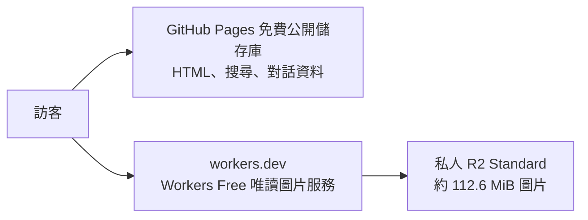

# 運河攻略：GitHub Pages ＋私人 R2 圖庫

已包含最新對話查圖功能、精確畫面連結、No.274 楊教授原版截圖，以及 No.275 的教授版同文對照。正式網站已發布：[https://wackyjazz.github.io/softlipa_canal/](https://wackyjazz.github.io/softlipa_canal/)。部署交接與更新方式請讀 [DEPLOYMENT_STATUS.md](DEPLOYMENT_STATUS.md)。使用者確認 Workers Free，部署沒有升級方案。

**先讀 [免費條件與限制](FREE-TIER.md)。R2 是有免費額度的用量計費服務，不是無条件零帳單服務。若你不接受啟用任何計費服務，請直接使用文末的純 GitHub Pages 方案。**

## 架構



訪客沒有寫入或列出 R2 的 API。Worker 只接受本包清單內的 AVIF／JPEG；每次請求至多一次 R2 GetObject，沒有圖片轉換、重試、KV、D1 或付費 Worker。圖片服務到達免費請求上限時停止服務，不透過 R2 公開網址繞過上限。

- `web/`：要放在 GitHub 的網頁程式、字型與搜尋資料。
- `r2-images/`：原版截图，已加入 `.gitignore`，用來上傳 R2。
- `cloudflare/`：唯讀 Worker、圖檔清單、測試及鎖定版本的工具。
- `tools/`：頁面建置及有容量限制的上傳工具。
- `.github/workflows/pages.yml`：手動執行的 GitHub Pages 部署流程。

## 1. 本機檢查

需要 Python 3.10+、Node.js 22+、Git。命令請在本資料夾開啟終端機執行；Windows 可使用 `py -3` 代替 `python3`。

```sh
python3 tools/upload_r2.py
cd cloudflare
npm ci
npm test
npm run check
cd ..
```

第一個命令只驗證圖片、計算容量，不需要憑證，也不會呼叫 Cloudflare。`npm run check` 是 Worker 的 dry-run，沒有部署。

## 2. 建立免費圖片入口

1. 使用 GitHub Free 與 Cloudflare Free 帳號；在 Cloudflare 的 Workers & Pages 確認 **Workers Free**，不要升級 Workers Paid。
2. R2 需要先開通。若開通頁面要求付款方式，先決定是否接受 R2 的用量計費；不接受就改用文末的零 R2 方案。本包不會自動接受訂閱。
3. 建立名為 `canal-guide-images` 的獨立 **Standard** bucket。不要開啟 `r2.dev` 公開存取、Custom Domains、Infrequent Access、Sippy 或資料轉換服務。
4. 在 R2 建立只限此 bucket 的「Object Read & Write」S3 憑證。Account ID、Access Key ID、Secret Access Key 只在本機使用，不要貼到對話、GitHub 程式碼或網頁。
5. 在本機環境變數設定 `CLOUDFLARE_ACCOUNT_ID`、`R2_ACCESS_KEY_ID`、`R2_SECRET_ACCESS_KEY`。請依終端機的環境變數語法設定，確認沒有把密鑰寫進要上傳的檔案。

安裝上傳工具並執行；這一步才會寫入你指定的 R2 bucket：

```sh
python3 -m venv .venv
# Linux / macOS / WSL:
. .venv/bin/activate
# Windows PowerShell 請改用：.venv\Scripts\Activate.ps1
python -m pip install -r tools/requirements.txt
python tools/upload_r2.py --apply --free-account-confirmed
```

`--free-account-confirmed` 表示你已依 FREE-TIER.md 確認免費方案、私人 bucket 及帳號其他用量。它不代表工具能替 Cloudflare 設定全帳號的帳單上限。工具會驗證所有圖片 SHA-256，跳過已上傳的內容；bucket 超過本包保守的 1 GB／10,000 個物件限制時拒絕上傳，不會自動刪除舊圖。

部署圖片 Worker：

```sh
cd cloudflare
npx wrangler login
npm run deploy
cd ..
```

記下實際網址，例如 `https://canal-guide-images.your-subdomain.workers.dev`。不用購買網域。登入所選 Cloudflare 帳號須與圖片 bucket 相同。這份設定不包含任何其他付費資源。

## 3. 建立公開 GitHub 儲存庫

建立一個空白的 **Public** repository，例如 `canal-guide`。在本資料夾執行以下命令，將最後一行的 OWNER 改成你的 GitHub 名稱：

```sh
git init
git add .
git status --short
# 確認沒有 r2-images、node_modules、密鑰或 .env 後再提交。
git commit -m "Add Canal illustrated guide and read-only image gateway"
git branch -M main
git remote add origin https://github.com/OWNER/canal-guide.git
git push -u origin main
```

只提交這個資料夾，**不要提交上層遊戲 EXE、存檔或其他工作資料**。`.gitignore` 已排除圖片原檔、環境檔與安裝依賴。

儲存庫設定：

1. **Settings → Pages → Source**：選 GitHub Actions。
2. **Settings → Secrets and variables → Actions → Variables**：新增 `R2_IMAGE_BASE`，值填步驟 2 的 `https://…workers.dev` 網址，不加 `/images`。這是公開圖片入口，不是密鑰。
3. **Actions → Publish guide to GitHub Pages → Run workflow**。
4. 完成後網址會是 `https://OWNER.github.io/canal-guide/`，以 GitHub 顯示的實際網址為準。

Workflow 只允許公開儲存庫；網址沒有填寫或不是 workers.dev 時會停止建置，避免發佈破圖頁面。Cloudflare 憑證不需要放入 GitHub Actions。

## 4. 驗收與更新

搜尋 `Gina` → 點教授版結果，應開啟第 5 張圖；重新整理後仍應保持 `#e274/frame/5`。No.275 會明確標為教授版同文對照。再搜尋 `非工作人員`，核對左側櫃檯入口畫面。

更新時先上傳新圖片，再部署新版 Worker 清單，最後部署 Pages。圖檔使用內容雜湊命名，重複執行不會重傳未變更圖片。工具保留舊圖，超過容量限制後需要自行評估清理；不要刪掉目前網站還在使用的物件。不要移除本機 `.upload-ledger.json` 來繞過操作預算。

本機預覽 R2 版本：

```sh
python3 tools/build_site.py --image-base https://canal-guide-images.your-subdomain.workers.dev
python3 -m http.server 8080 --directory _site
```

## 完全不開通 R2：純 GitHub Pages

如果「免費」的意思是不要付款方式、不要任何 R2 超額扣款可能，這個方案更合適。目前圖片約 112.6 MiB，低於 GitHub Pages 1 GB 網站限制。

```sh
python3 tools/build_site.py --mode github-only
python3 -m http.server 8080 --directory _site
```

把 `_site` **裡面的內容**（含 `.nojekyll`）放入另一個公開儲存庫的根目錄，Settings → Pages 選 **Deploy from a branch → main → /(root)**。不要使用本包的 R2 workflow，也不需要 Cloudflare 帳號。圖片多，建議用 Git 上傳，不用瀏覽器逐張拖曳。

官方資料：[GitHub Pages 免費公開儲存庫與限制](https://docs.github.com/en/pages/getting-started-with-github-pages/github-pages-limits)、[Pages 部署流程](https://docs.github.com/en/pages/getting-started-with-github-pages/using-custom-workflows-with-github-pages)、[R2 boto3 設定](https://developers.cloudflare.com/r2/examples/aws/boto3/)。


圖片已在本機預先壓縮為 AVIF，沒有啟用 Cloudflare 付費圖片轉換。保持原始 1200×900 尺寸，請使用支援 AVIF 的瀏覽器。

## 新增原始設計圖庫

`web/collection/` 收錄 538 項視覺素材與 3,202 格動畫，約 54.8 MiB。此部分隨 GitHub Pages 靜態檔發布；原尺寸圖只在使用者點選時載入，列表採小型無損縮圖。R2 仍只處理原本 734 張攻略截圖；不需新增 bucket、Worker 路由或付費服務。完整素材包的約 104 MiB 音訊沒有加入網頁。詳見 `HANDOFF_ASSETS_AND_WEB.md`。

## 使用已登入的 Wrangler 更新 R2

除了既有 S3 上傳方式，也可使用 `tools/upload_r2_oauth.py`，預設只檢查本機。明確指定 --apply --free-account-confirmed --account 與本機 --auth-file 後，才會上傳。沿用容量／操作預算、私人 Standard bucket 檢查、雜湊驗證及跳過相同物件；不需要將任何登入憑證放到 GitHub。
